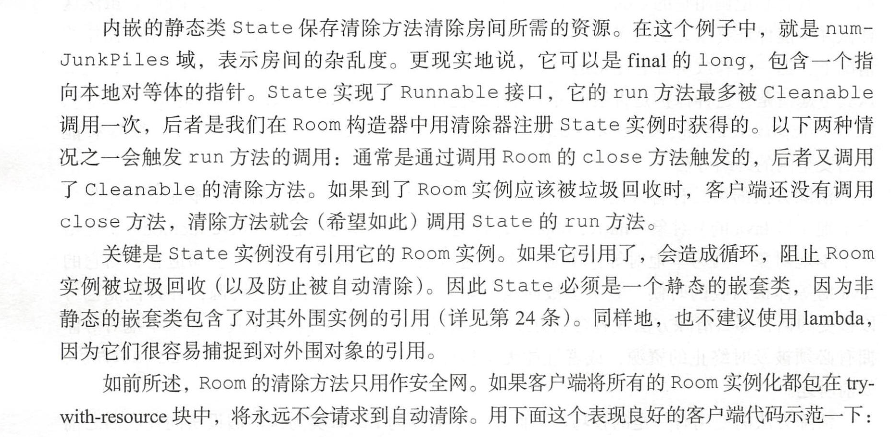

```java
    public static void main(String[] args) {
        try (Room myroom = new Room(10)) {
            System.out.println("goodbye");
        } catch (Exception e) {
            throw new RuntimeException(e);
        }
    }
```